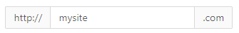
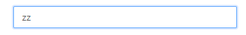
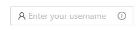
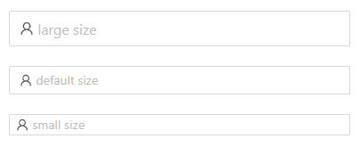
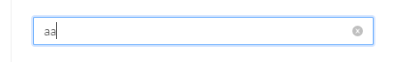
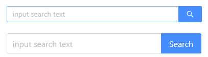
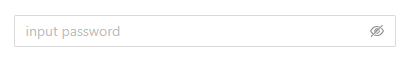
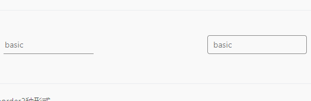

> UI由MaterialUI+Antd风格的UI实现

> 这篇文章主要实现input组件

# 一、搭建基础框架

src下新建input文件夹，input文件夹下新建Input.js文件,为什么不建index.js呢，因为index.js作为我们的入口文件，我们更希望他有作为入口文件导出组件的功能。
<details> 
<summary>完整代码</summary>

```js
//Input.js
import React,{forwardRef} from 'react';
//classNames为一个合成class类名的函数
import { classNames } from '../components/helper/className';
//全局配置 配置全局的class类名前缀
import { ConfigContext } from '../ConfigContext';
import "./index.scss";

//React.forwardRef 会创建一个React组件，这个组件能够将其接受的 ref 属性转发到其组件树下的另一个组件中
const Input=forwardRef((props,ref)=>{

    const {
        prefixCls:customizePrefixCls,
        className
    }=props;
    
    const { getPrefixCls } = useContext(ConfigContext);

    const prefixCls = getPrefixCls("input", customizePrefixCls);

    return (
        <div ref={ref} className={classNames(
            prefixCls,
            className
        )}>

        </div>
    )
})

export default Input;
```

```css
//index.scss
//采用scss编写 可以复用变量等
@import "./../components/styles/variable.scss";

$prefixCls:"#{$global-prefix}-input";//主

.#{$prefixCls}{

}

```
</details>


# 二、整理需求

> 我们通过整理的需求来设计我们的API,个人认为设计API是最难得一部分,我们这里参照ANTD的API进行设计,个人认为ANTD的API更全面，更丰富。

## 1.addonAfter/addonBefore
>带标签的input输入框，这里指的是在input框前(后)设置一个标签，类型可以是*string/reactnode*,如下图：



```js
<Input addonAfter={".com"} addonBefore={"http://"} defaultValue={"mysite"}/>
```


## 2.value/defaultValue
>指定输入框的值或者输入框的默认内容如下图：



```js
<Input defaultValue={"zz"} />
```

## 3.disabled
>是否禁用状态,如下图:


```js
<Input disabled/>
```

## 4.id 
>输入框的 id


## 5.maxLength

>输入框的最大输入length

## 6.prefix/suffix

>带有前缀/后缀图标的 input如下图：



```js
<Input
      placeholder="Enter your username"
      prefix={<UserOutlined  />}
      suffix={
        <InfoCircleOutlined style={{ color: 'rgba(0,0,0,.45)' }} />
      }
/>
```

## 7.size

>控件大小。如下图：



```js
<Input size="large" placeholder="large size"/>
<Input size="default" placeholder="default size"/>
<Input size="small" placeholder="small size"/>
```

## 7.type

>声明 input 类型，同原生 input 标签的 type 属性。

## 8.onChange

>输入框内容变化时的回调。

## 9.onPressEnter

>按下回车的回调

## 10.allowClear

>可以点击清除图标删除内容,如下图：



```js
<Input allowClear />
```


## 11.Input.Search的enterButton

>是否有确认按钮，可设为按钮文字,如下图：




```js
<Input enterButton />

<Input enterButton={"Search"} />
```

## 12.Input.Search的onSearch

>点击搜索或按下回车键时的回调

## 13.Input.Search的loading

>搜索 loading

## 14.Input.TextArea的autoSize

>自适应内容高度，可设置为 true|false 或对象：{ minRows: 2, maxRows: 6 }。

## 15.Input.TextArea的defaultValue/value

>输入框默认内容，同input

## 16.Input.TextArea的onPressEnter

>按下回车的回调,同input

## 17.Input.TextArea的allowClear

>可以点击清除图标删除内容,同input

## 18.Input.TextArea的onResize

>resize 回调

## 19.Input.Password的visibilityToggle

>是否显示切换按钮



```js
<Input.Password placeholder="input password" visibilityToggle={true}/>
```

## 22.border
>定义border来指示input框是否有border

# 三、定义input基础风格（实现border API）

>我们是根据materialui风格来设计的，必定要和antd风格与众不同,我们设计2种不同的风格来区别于antd的单一风格。
<details> 
<summary>完整代码</summary>
 
```js
//Input.js
......
......

const Input=forwardRef((props,ref)=>{

    const {
        ...
        placeholder,//占位符 原生input框属性
        border,//定义是否有边框属性
    }=props;
    
    ......
    ......

    const [ active,setActive]=useState(false);

    .....
    .....

    const handleFocus=(e)=>{//input触发焦点事件
        setActive(true);
    }
    const handleBlur=(e)=>{//input离开焦点事件
        setActive(false);
    }

    return (
        <div ref={ref} className={classNames(
            prefixCls,
            className,
            {
                [`${prefixCls}-focus`]:active,
                [`${prefixCls}-border`]:border
            }
        )}>
            <div className={classNames(
                `${prefixCls}-inputWrapper`
            )}>
                <input 
                    placeholder={placeholder} 
                    onFocus={handleFocus}
                    onBlur={handleBlur}
                />
            </div>
        </div>
    )
})

export default Input;
```

```css
//index.scss
@import "./../components/styles/variable.scss";

$prefixCls:"#{$global-prefix}-input";
$inputWrapperPrefixCls:"#{$prefixCls}-inputWrapper";

.#{$prefixCls}{
    position:relative;

    &-focus{
        .#{$inputWrapperPrefixCls}{
            &:after{
                transform: scaleX(1);
            }
        }
    }

    &-border{
        .#{$inputWrapperPrefixCls}{
            input{
                padding:6px 10px;
            }

            &:before{
                top:0;
                border-radius: 4px;
                border:1px solid rgba(0,0,0,.45);
                transition: border-color 200ms cubic-bezier(0.4, 0, 0.2, 1) 0ms;
            }
    
            &:after{
                top:0;
                border:2px solid $primary-color;
                border-radius: 4px;
            }
            
        }
    }

    &-inputWrapper{
        
        input{
            height: 20px;
            line-height: 20px;
            padding: 6px 2px;
            border:0;
            outline: none;
            box-sizing: content-box;
        }

        &:before{
            content: "";
            display: block;
            left:0;
            right:0;
            bottom:0;
            border-bottom:1px solid rgba(0,0,0,.45);
            position: absolute;
            pointer-events: none;
            transition: border-bottom-color 200ms cubic-bezier(0.4, 0, 0.2, 1) 0ms;
        }

        &:after{
            content: "";
            display: block;
            left:0;
            right:0;
            bottom:0;
            transform: scaleX(0);
            border-bottom:2px solid $primary-color;
            position: absolute;
            pointer-events: none;
            transition: transform 200ms cubic-bezier(0.4, 0, 0.2, 1) 0ms;
        }

    }
}
```
</details>
 
>用过定义一个内部激活状态来通过input框的状态展示不同的效果,这里有2种形式，一种是无边框形式，一种是有边框展示。

>注意：虽然UI框架最重要的css部分，但是我们这里更注重实现思路与逻辑。



```js
<Input placeholder="basic"/>
<Input placeholder="basic" border/>
```

# 四、实现addonAfter/addonBefore API

>可以在input框外部的前面/后面实现类似前缀/后缀的效果,其中并没有什么需要注意的点！

<details>
<summary>完整代码</summary>
```js

......
......

const Input = forwardRef((props, ref) => {

    const {
        ......
        ......
        addonAfter,
        addonBefore,
    } = props;

    return (
        <div ref={ref} className={classNames(
            prefixCls,
            className,
            {
                [`${prefixCls}-focus`]: active,
                [`${prefixCls}-border`]: border,
                [`${prefixCls}-addonAfterExtra`]:!!addonAfter
            }
        )}>

            {addonBefore && <div className={classNames(
                `${prefixCls}-addonBefore`
            )}>
                {addonBefore}
            </div>}
......
......

            {addonAfter && <div className={classNames(
                `${prefixCls}-addonAfter`
            )}>
                {addonAfter}
            </div>}

        </div>
    )
})
......
......
```

```css
@import "./../components/styles/variable.scss";

$prefixCls:"#{$global-prefix}-input";//主
$inputWrapperPrefixCls:"#{$prefixCls}-inputWrapper";//主

.#{$prefixCls}{
......
......
    &-border{
        .#{$inputWrapperPrefixCls}{
            input{
                padding:6px 10px;
            }

            &:before{
                top:0;
                border-radius: 4px;
                border:1px solid rgba(0,0,0,.45);
                transition: border-color 200ms cubic-bezier(0.4, 0, 0.2, 1) 0ms;
            }
    
            &:after{
                top:0;
                border:2px solid $primary-color;
                border-radius: 4px;
            }
            
        }
        
        .#{$prefixCls}-addonBefore{
             
            &:before{
                border : 1px solid rgba(0, 0, 0, 0.45);
                top:0;
                border-right:0;
                border-top-left-radius:4px;
                border-bottom-left-radius:4px;

            }

            & + .#{$inputWrapperPrefixCls} { 
                &:before{
                    border-top-left-radius:0px;
                    border-bottom-left-radius: 0px;
                    
                }

                &:after{
                    border-top-left-radius:0px;
                    border-bottom-left-radius: 0px;
                }
           }
        }

        .#{$prefixCls}-addonAfter{
             
            &:before{
                border : 1px solid rgba(0, 0, 0, 0.45);
                top:0;
                border-left:0;
                border-top-right-radius:4px;
                border-bottom-right-radius:4px;
            }
        }

        &.#{$prefixCls}-addonAfterExtra{
            .#{$inputWrapperPrefixCls} { 
                &:before{
                    border-top-right-radius:0px;
                    border-bottom-right-radius: 0px;
                    
                }
                &:after{
                    border-top-right-radius:0px;
                    border-bottom-right-radius: 0px;
                }
           }
        }
    }

    &-addonBefore{

        line-height: 32px;
        padding:0 4px;
        position:relative;

        &:before{
            
            content: "";
            display: block;
            left: 0;
            right: 0;
            bottom: 0;
            border-bottom: 1px solid rgba(0, 0, 0, 0.45);
            position: absolute;
            pointer-events: none;
            transition: border-bottom-color 200ms cubic-bezier(0.4, 0, 0.2, 1) 0ms;
        }
    }

    &-addonAfter{

        line-height: 32px;
        padding:0 4px;
        position:relative;

        &:before{
            
            content: "";
            display: block;
            left: 0;
            right: 0;
            bottom: 0;
            border-bottom: 1px solid rgba(0, 0, 0, 0.45);
            position: absolute;
            pointer-events: none;
            transition: border-bottom-color 200ms cubic-bezier(0.4, 0, 0.2, 1) 0ms;
        }
    }

    &-inputWrapper{

        position: relative;
        
        input{
            height: 20px;
            line-height: 20px;
            padding: 6px 2px;
            border:0;
            outline: none;
            box-sizing: content-box;
        }

        &:before{
            content: "";
            display: block;
            left:0;
            right:0;
            bottom:0;
            border-bottom:1px solid rgba(0,0,0,.45);
            position: absolute;
            pointer-events: none;
            transition: border-bottom-color 200ms cubic-bezier(0.4, 0, 0.2, 1) 0ms;
        }

        &:after{
            content: "";
            display: block;
            left:0;
            right:0;
            bottom:0;
            transform: scaleX(0);
            border-bottom:2px solid $primary-color;
            position: absolute;
            pointer-events: none;
            transition: transform 200ms cubic-bezier(0.4, 0, 0.2, 1) 0ms;
        }

    }
}
```

</details>

# 五、实现value/defaultValue API
>在input等表单组件中，value属性是不可或缺的，那么在这里我们，如果实现呢？在input标签中,如果存在value值，默认为这个input标签为一个是受控组件,所谓受控组件就是每当表单的状态发生变化时，都会被写入到组件的state中，这种组件就被称为受控组件。在react中，提供value属性就要提供onchange函数来更改state。在这里我们使用一个自定义hooks表示这种情况。

```js
//utils/useControlled.js文件
//当存在value时，不能在内部修改value的值
import React from 'react';

export default function useControlled({controlled,default:defaultProps}){

    const { current:isControlled}=React.useRef(controlled!==undefined);
    
    const [valueState,setValueState]=React.useState(defaultProps);

    const value=isControlled?controlled:valueState;

    const setValueIfControlled=React.useCallback((newValue)=>{
        if(!isControlled){
            setValueState(newValue)
        }
    },[value]);

    return [value,setValueIfControlled]
}   
//使用
const [value,setValue]=useControlled({
    controlled:value,
    default:defaultValue
})
````

<details>
<summary>完整代码</summary>

```js
import useControlled from '../_utils/useControlled';
......
......
const {
    value:valueProps,
    defaultValue
}=props;
......
......
const [value,setValue]=useControlled({
    controlled:valueProps,
    default:defaultValue
})
......
......
const handleChange=(e)=>{

}
......
......
//这里input如果存在value值，必须存在change事件，否则react会给出警告
<input 
    value={value}
    onChange={handleChange}
/>
```

</details>

# 六、实现disabled API

>disabled属性几乎是每个可点击/可输入的一个必备功能了,开启以后不可点击

<details>
<summary>重点代码</summary>

```js
......

const Input = forwardRef((props, ref) => {

    const {
        .......
        disabled
    } = props;

    ........

    return (
        <div ref={ref} className={classNames(
                ......
            {
                .......
                [`${prefixCls}-disabled`]:disabled
            }
        )}>
        ......

            <div className={classNames(
                .......
                {
                    [`${prefixCls}-disabled`]:disabled
                }
            )}>
                <input
                    ......
                    ......
                    disabled={disabled}
                />
            </div>
  ......
  ......
        </div>
    )
})

export default Input;
```

```css
.......

.#{$prefixCls}{
    ....

    &-disabled{
        background-color: rgba(0,0,0,0.1);

        input{
            cursor: not-allowed;
            background-color: rgba(0,0,0,0.1);
        }

        >*{
            cursor: not-allowed;
        }
    }

    &-focus{
        .#{$inputWrapperPrefixCls}{
            &:not(.#{$prefixCls}-disabled):after{
                transform: scaleX(1);
            }
        }
    }

     &-border{
        .#{$inputWrapperPrefixCls}{
            ......

            &:not(.#{$prefixCls}-disabled):hover{
                &::before{
                    border:2px solid rgba(0,0,0,.86);
                }        
            }
    
            ......
            
        }
        
        
    }


    &-inputWrapper{

        ......

        &:not(.#{$prefixCls}-disabled):hover{
            &::before{
                border-bottom:2px solid rgba(0,0,0,.86);
            }        
        }
       
        ......

    }

   
}
```
</details>

>css属性:cursor:not-allowed;

# 七、id和maxLength
>由于id和maxLength都是原生属性，所以我们只需要传到组件并赋值给input标签就行了

<details>
<summary>重点代码</summary>

```js
......
const {
    ......
    id,maxLength
}=props
......
<input
    ......
    id={id}
    maxLength={maxLength}
    .....
/>
......
```
</details>

# 八、实现prefix和suffix

>实现框内前缀、后缀

<details>
<summary>重点代码</summary>

```js
......

const Input = forwardRef((props, ref) => {

    const {
        ......,
        suffix,
        prefix,
    } = props;

   
                {
                    prefix && <span className={classNames(`${prefixCls}-prefix`)}>
                        {prefix}
                    </span>
                }

                <input
                    ......
                />

                {
                    suffix && <span className={classNames(`${prefixCls}-suffix`)}>
                        {suffix}
                    </span>
                }

         .....
```

```css
    &-suffix,&-prefix{
        display: inline-flex;
        align-items: center;
        justify-content: center;
        line-height: 1.5;
        min-width: 16px;
    }

    &-prefix{
        margin-left:4px;
    }

    &-suffix{
        margin-right: 4px;
        flex:none;
    }
```
</details>

# 九、实现size和type

>在这里，我们和antd的size尺寸保持一致，small="24px",default="32px",large="40px"

>type是原生input框属性，只要将属性赋予给input就行

<details>
<summary>重点代码</summary>

```js
const {
    size,
    type
}=props;
......
......
     [`${prefixCls}-${size}`]: size

     <input
        ......
        type={type}
     />
......
```

```css
&-small{
        input{
            padding:2px 2px;
            height:20px;
        }
        
        &.#{$prefixCls}-border{
            input{
                padding:2px 2px;
                height:20px;
            }
        }

        .#{$prefixCls}-addonBefore{
            line-height: 1.5;
        }
        .#{$prefixCls}-addonAfter{
            line-height: 1.5;
        }
    }

    &-large{
        input{
            padding:4px 4px;
            height:32px;
        }
        
        &.#{$prefixCls}-border{
            input{
                padding:4px 4px;
                height:32px;
            }
        }

        .#{$prefixCls}-addonBefore{
            line-height: 40px;
        }
        .#{$prefixCls}-addonAfter{
            line-height: 40px;
        }
    }
```

</details>

# 十、实现onChange和onPressEnter、onKeyDown

>onChange只需在input的change事件进行回调就行

>onPressEnter在按下回车键时进行回调，传出此时的input框value值就行

>onKeyDown是在input按键被按下时的回调

<details>
<summary>重点代码</summary>

```js
const {
    onChange,
    onKeyDown,
    onPressEnter
}=props;

const handleChange = (e) => {//change事件
        if(onChange){
            onChange(e.target.value,e)
        }
        setValue(e.target.value);
}

const handleKeyDown = (e) => {//keydown事件
        if (onKeyDown) {
            onKeyDown(e.keyCode, e);
        }
        if (e.keyCode === 13) {
            if (onPressEnter) {
                onPressEnter(e)
            }
         
        }
};

<input 
    value={value?value:""}
/>

```
</details>

>这里有一点需要⚠️，就是input的标签要写成上面这种形式，如果初始化值为undefined，他默认认为组件是非受控组件，如果赋值为value，就变成了受控组件，而他会报警告!所以没有value时赋值为一个空字符串。

# 十一、实现allowClear和对应的onClear函数

>分析：当input内有值时，展示一个圆叉按钮，可以清除出入框里面的内容,这个圆叉位置应该和suffix的位置保持一致

<details>
<summary>重点代码</summary>

```js
    ....
    const {
        allowClear,
        onClear
    }=props;

    ....

    const handleClearValue=(e)=>{
        if (!value) {
            return;
        }
        if (onClear) {
            onClear("", e);
        }
        setValue("");
        if (onChange) {
            onChange("",e);
        }
    }
    ....

    {
                    (suffix||allowClear) && <span className={classNames(`${prefixCls}-suffix`)}>
                        {allowClear && <Fade in={value ? true : false}><Icon name="close-circle" style={{ fontSize: 16,color:"rgba(0,0,0,.4)" }} onClick={(e) => handleClearValue(e)} /></Fade>}
                        {suffix}
                    </span>
    }
    ....
```
</details>

>上面的Fade和Icon都是我们的组件，后续我们会说到，只负责圆叉图标和css特效


# 十二、实现Input.Search的API

>我们以Input为基础组件，扩展Input.Search方法,新建Search.js文件

<details>
<summary>重点代码</summary>

```js
//Search.js
import React, { useContext } from 'react';
import { classNames } from '../components/helper/className';
import Input from './Input';
import Icon from '../components/icon';
import { ConfigContext } from '../ConfigContext';
 
import "./index.scss";
 
const Search = (Props) => {

    const {
        prefixCls:customizePrefixCls,
        enterButton,
        ...restProps
    } = Props;

    const { getPrefixCls } =useContext(ConfigContext);

    const prefixCls=getPrefixCls("input-search",customizePrefixCls);
 
    return (
        <Input enterButton={enterButton} className={classNames(prefixCls)} {...restProps} suffix={!enterButton && <Icon name="find" style={{fontSize:"16px"}}/>}/>
    )
}

export default Search;

//Input.js
......
const Input = forwardRef((props, ref) => {

    const {
        ......
        enterButton,
        onSearch,
        loading
    } = props;

     

    ......

    const handleSearch=(e)=>{
        if(onSearch){
            onSearch(value,e);
        }
    }
    
    const sizeObj = {
        "small": "24px",
        "large": "40px",
        "default": "32px",
        undefined: "32px"
    }
    
    return (
        ......
                {
                    enterButton && <span className={classNames(
                        `${prefixCls}-enterButton`,
                        {
                            [`${prefixCls}-disabled`]: disabled,
                        }
                    )}>
                        <Button disabled={disabled} loading={loading} type="primary" style={{ height: sizeObj[size] }} onClick={(e) => handleSearch(e)}>
                            {
                                enterButton === true ?
                                    <Icon name="find" style={{ fontSize: "16px" }} /> :
                                    enterButton
                            }
                        </Button>
                    </span>
                }

            </div>

        ......

        </div>
    )
})

export default Input;
```
</details>

# 十三、实现Input.TextArea

>我们以Input为基础组件，扩展Input.Textarea方法,新建Textarea.js文件，这里原生的Textarea是不支持高度随着内容区域变化的，所以这里TextArea的实现稍微有些复杂

>为了实现onResize API 我们使用js的一个API:ResizeObserver,具体可以百度下，这个API在样式变化等情况下会触发回调。

```js
//这个组件在样式变化是触发一个回调
import React,{forwardRef,useRef, useEffect} from 'react';
import { toArray } from '../_utils/reactUtils';
import { supportRef,composeRef } from '../_utils/ref';
import setRef from '../_utils/setRef';
import useForkRef from '../_utils/useForkRef';
import ResizeObserver from 'resize-observer-polyfill';
import { findDOMNode } from 'react-dom';

const ResizeObserverComponent=forwardRef((props,ref)=>{

    const {
        children:childrenProps,
        onResize
    }=props;

    const childNode=useRef(null);

    const currentELement=useRef(null);

    const resizeObserver=useRef(null);

    const onComponentUpdated=()=>{
        const element=findDOMNode(childNode.current);
        const elementChanged=element!==currentELement.current;

        if(elementChanged){
            destroyObserver();
            currentELement.current=element;
        }

        if(!resizeObserver.current && element){
            resizeObserver.current=new ResizeObserver(handleResize);
            resizeObserver.current.observe(element);
        }
    }

    const destroyObserver=()=>{
        if(resizeObserver.current){
            resizeObserver.current.discount();
            resizeObserver.current=null;
        }
    }

    const handleResize=()=>{
        if(onResize){
            onResize();
        }
    }

    useEffect(()=>{
        onComponentUpdated()
        return ()=>destroyObserver()
    },[]);

    const handleNodeRef=(node)=>{
        setRef(childNode,node)
    }

    const handleRef =useForkRef(handleNodeRef,childrenProps.ref);

    return  React.cloneElement(childrenProps,{
        ref:handleRef
    });
}); 

export default ResizeObserverComponent;
```

<details>
<summary>重点代码</summary>

```js
//TextArea方法
import React, { useContext, useEffect,useRef,useState } from 'react';
import { classNames } from '../components/helper/className';
import Input from './Input';
import { ConfigContext } from '../ConfigContext';
import calculateNodeHeight from './calculateNodeHeight'
import ResizeObserver from '../ResizeObserver';
import "./index.scss";
 
const TextArea = (Props) => {

    const {
        prefixCls:customizePrefixCls,
        autoSize,
        onResize,
        onChange,
        ...restProps
    } = Props;

    const { getPrefixCls } =useContext(ConfigContext);

    const [textareaStyles,setTextareaStyles]=useState({});

    const isChange=useRef(null);

    const textAreaRef=useRef(null);

    const prefixCls=getPrefixCls("input-textarea",customizePrefixCls);

    const resizeTextarea=()=>{
        if(!autoSize||!textAreaRef.current){
            return ;
        }
        const {minRows,maxRows}=autoSize;
        const textareaStyles = calculateNodeHeight(textAreaRef.current, false, minRows, maxRows);
        setTextareaStyles(textareaStyles);

    }

    useEffect(()=>{
        resizeTextarea();
    },[autoSize]);

    const saveTextArea=(node)=>{
        textAreaRef.current=node;
    }

    const handleChange=(value,e)=>{
        resizeTextarea();
        isChange.current=value;
        if(onChange){
            
            onChange(value,e);
        }
    }

    const handleResize=()=>{
        if(!isChange.current){
            return ;
        }
        if(onResize){
            onResize();
        }
    }
 
    return (
        <ResizeObserver onResize={handleResize}>
            <Input 
                component={"textarea"} 
                className={classNames(prefixCls)} 
                onChange={handleChange}
                ref={saveTextArea} 
                textareaStyles={{
                    ...textareaStyles
                }} 
                {...restProps} 
            />
        </ResizeObserver>
    )
}

export default TextArea;
 
```

>实现高度自适应的原理是，计算每一个textarea的滚动高度，然后将滚动高度赋值给textare即可。

```js
......
    const {
......       
        component:Component="input",
        textareaStyles
    } = props;
......
                <Component
                    .....
                    style={textareaStyles}
                    ref={ref}
                />
.....
       
```

```css
input,textarea{
            font:inherit;
            color:currentColor;
            outline: none;
            border:0;
            max-width:100%;
            background: none;
            flex:1;
            line-height:1.5;
}
textarea{
            padding:5px 0px 5px 6px;
            box-sizing: content-box;
}
input{
            height: 20px;
            line-height: 20px;
            padding: 6px 2px;
            box-sizing: content-box;
}
```

</details>

# 十四、实现Input.Password的visibilityToggle和onToggle方法

<details>
<summary>重点代码</summary>

```js
//Password.js
import React, { useContext, useState, useCallback } from 'react';
import { classNames } from '../components/helper/className';
import Input from './Input';
import Icon from '../components/icon';
import { ConfigContext } from '../ConfigContext';

import "./index.scss";
 
const Password = (Props) => {

    const {
        prefixCls:customizePrefixCls,
        visibilityToggle=false,
        onToggle,
        ...restProps
    } = Props;

    const [type,setType]=useState("password");

    const { getPrefixCls } =useContext(ConfigContext);

    const prefixCls=getPrefixCls("input-password",customizePrefixCls);

    const toggleVisible=useCallback((e)=>{
        if(onToggle){
            onToggle(type==="password"?false:true)
        }
        if(type==="password"){
            setType("text");
        }else{
            setType("password");
        }
    },[type]);
 
    return (
        <Input  
            type={type} 
            suffix={visibilityToggle && <Icon name={type==="password"?"eye-off":"eye"} style={{fontSize:16}} onClick={(e)=>toggleVisible(e)}/>} 
            className={classNames(prefixCls)} {...restProps} 
        />
    )
}

export default Password;
```
</details>
